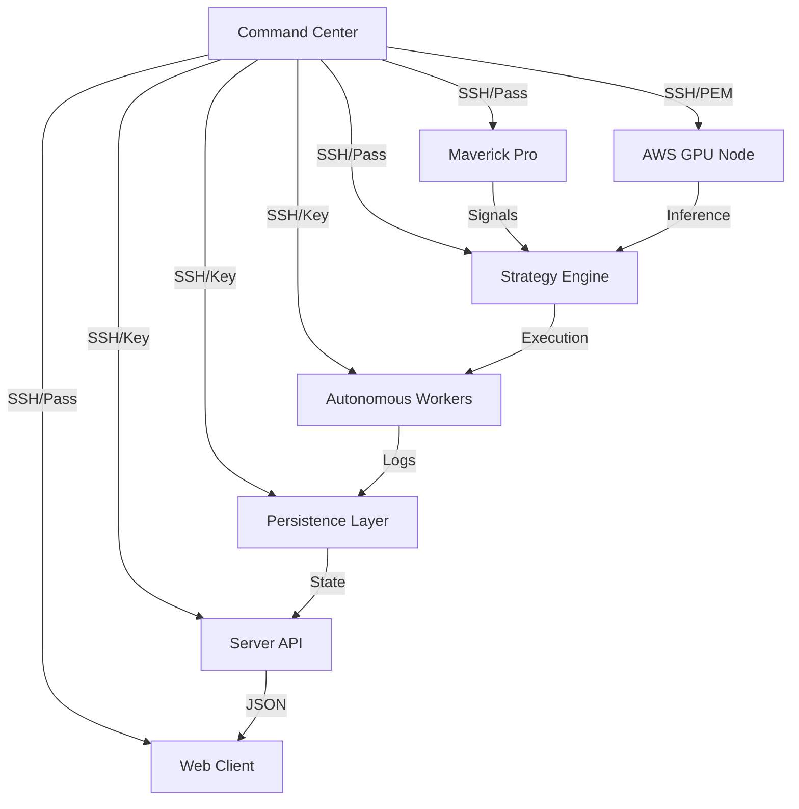

# 📡 AI-Fi :: Command Center (CNS - Central Nervous System)

## 🌌 The Nexus
The Command Center is the high-security orchestration hub of the AI-Fi Organism. It governs the internal network topology and manages the cryptographic identities required for cluster coherence.

## 🗺️ Cluster Architecture Diagram

## 🧠 Operational Manifest
- **`ShadowPortfolioEngine.cjs`**: The real-time valuation engine. Uses an Atomic Load Pattern for state persistence.
- **`scan_cluster.py`**: A multi-threaded prober using `pexpect` to verify system integrity across 8 nodes.
- **`v10_audit_method.js`**: The canonical method for auditing system 'stress' levels.

## 🛠️ Failure Modes & Mitigations
| Failure | Mitigation |
| :--- | :--- |
| **Key Corruption** | Restore from GitHub Secret or `RECONSTRUCTION.md`. |
| **IP Drift** | Update `NODES` array in `scan_cluster.py` and `CLUSTER_ACCESS.md`. |
| **Sync Lag** | Adjust cron frequency in `sync_shadow_to_web.sh`. |

---
[Master Construction Blueprint](https://github.com/kunleulysses/aifi-command-center/blob/master/RECONSTRUCTION.md)
