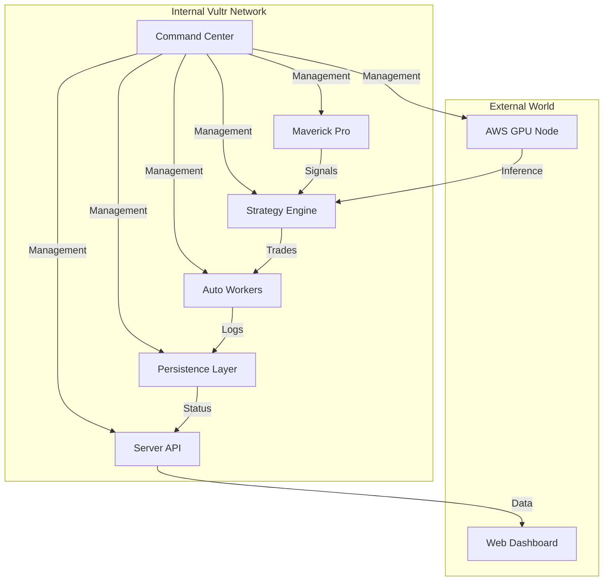

# 🏗️ AI-Fi CLUSTER :: MASTER RECONSTRUCTION BLUEPRINT

This guide provides the definitive technical path to reassembling the AI-Fi nodebase from zero to a fully operational state.

## 🗺️ High-Level Cluster Topology

---

## 🚀 The 4-Phase Restoration Protocol

### Phase 1: Infrastructure Core
1. **Nodes**: Provision 7x Standard Vultr Nodes (Ubuntu 22.04) and 1x AWS g4dn.xlarge Instance.
2. **IP Mapping**: Assign internal IPs (10.1.96.x) using Vultr VPC.
3. **Primary Node**: Clone [aifi-command-center](https://github.com/kunleulysses/aifi-command-center) to the host designated as Command Center.

### Phase 2: Cryptographic Identity
1. **Secrets**: Restore `id_rsa` and `Touch a girl.pem` into the CC node.
2. **Hardening**: Run `chmod 600` on all keys.
3. **Map**: Update `CLUSTER_ACCESS.md` with the newly provisioned IP addresses.

### Phase 3: Distributed Deployment
1. **Auto-Clone**: Use the CC node to SSH into all targets and clone their respective repositories:
   - [aifi-maverick-pro](https://github.com/kunleulysses/aifi-maverick-pro)
   - [aifi-strategy-engine](https://github.com/kunleulysses/aifi-strategy-engine)
   - [aifi-web-client](https://github.com/kunleulysses/aifi-web-client)
   - [aifi-server-api](https://github.com/kunleulysses/aifi-server-api)
   - [aifi-auto-workers](https://github.com/kunleulysses/aifi-auto-workers)
   - [aifi-persistence-layer](https://github.com/kunleulysses/aifi-persistence-layer)
   - [aifi-aws-gpu-node](https://github.com/kunleulysses/aifi-aws-gpu-node)

### Phase 4: State Ingest & Activation
1. **Database**: Import `aifi_dump.sql` on the Persistence Node.
2. **Environment**: Run `npm install` on all nodes.
3. **Coherence**: Run `python3 verify_all.py` from the CC Node to confirm cluster pulse.

---

## 🛠️ Global Failure Modes
- **Heartbeat Timeout**: If inter-node latency exceeds 200ms, check VPC congestion.
- **DNA Rejection**: If the Strategy Engine doesn't recognize Maverick's signals, verify `dna_v2.json` integrity on Maverick.
- **Shadow Drift**: If theoretical P&L differs from audit logs, resync the `ShadowPortfolioEngine.cjs` state.

> [!IMPORTANT]
> Always install `sshpass` and `rsync` on the Command Center node before starting Phase 3.
