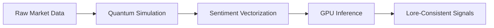

# 🌩️ AI-Fi :: AWS GPU Node (The Subconscious)

## 🌌 Higher-Order Processing
This node provides the heavy model inference required for Quantum-resistant cryptography and photorealistic image generation, offloading compute from the Vultr cluster.

## 🧠 Data Processing Cycle

## 📂 Deep File Manifest
- **`QuantumReceptor.cjs`**: Interface for AWS-native security and quantum cloud API.
- **`SentimentScraper.cjs`**: Specialized version optimized for high-throughput GPU ingest.

## 🛠️ Failure Modes & Mitigations
| Failure | Mitigation |
| :--- | :--- |
| **CUDA Driver Crash** | Run `nvidia-smi -r` followed by service restart. |
| **EBS Volume Space** | Cleanup logs or expand AWS volume via CLI. |
| **Inference Timeout** | Check `TensorBridge` logs on Command Center for rerouting. |
